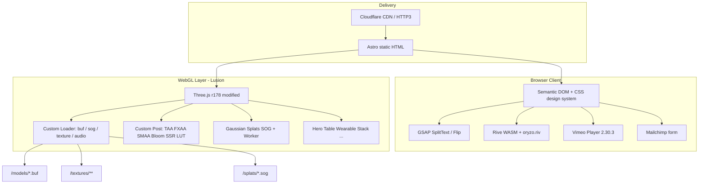

# ORYZO AI (`https://oryzo.ai/`) — Tech Stack Breakdown

เอกสาร reverse-engineering จาก HTML, HTTP headers, CSS, และ JS bundle ของเว็บ (ตรวจเมื่อ 2026-08-05)

> **หมายเหตุ:** เว็บนี้เป็นโปรเจกต์เสียดสี (satirical) ของสตูดิโอ [Lusion](https://lusion.co/) — ขาย “ที่รองแก้วคอร์กที่ powered by AI*” (*Adobe Illustrator) ซึ่งไม่มีอยู่จริง

---

## สรุปสั้น (TL;DR)

| ชั้น | เทคโนโลยี |
|------|-----------|
| Framework / SSG | **Astro** (static, asset hash ใต้ `/_astro/`) |
| Hosting / CDN | **Cloudflare** (HTTP/2 + HTTP/3, edge cache, Insights beacon) |
| 3D engine | **Three.js r178** (fork/แก้โดย Lusion) บน **WebGL2** |
| Gaussian Splats | custom `Splats` + **SOG** format + **Web Worker** + WASM sort |
| Geometry pipeline | custom binary **`.buf`** (ไม่ใช้ glTF บน production site) |
| Animation (UI/text) | **GSAP** + **SplitText** + **Flip** |
| Animation (vector/runtime) | **Rive** (`/rive/oryzo.riv` + WASM) |
| Video | **Vimeo Player** `v2.30.3` |
| Newsletter | **Mailchimp** |
| UI framework | **ไม่มี React/Vue/Svelte** — vanilla JS + DOM ที่ Astro เรนเดอร์ |
| CSS | custom design system (CSS variables + grid) — ไม่ใช่ Tailwind/Bootstrap |
| Fonts | **Literata**, **DM Mono**, MSDF **Inter** (WebGL text) |
| Studio / author | **Lusion** |

---

## 1. Hosting & Delivery

### Cloudflare

หลักฐานจาก response headers:

- `server: cloudflare`
- `cf-cache-status: HIT`
- `cf-ray`, `nel`, `report-to` (Cloudflare NEL)
- `alt-svc: h3=":443"` → รองรับ **HTTP/3 (QUIC)**
- `cache-control: public, max-age=0, must-revalidate` + ETag (immutable-friendly via hash filenames)
- Cloudflare Web Analytics / Insights: `static.cloudflareinsights.com/beacon.min.js`
- `robots.txt` มีบล็อก **Cloudflare Managed Content** + Content-Signal (`ai-train=no`)

### Static hosting pattern

- SPA/SSG หน้าเดียวหลัก: `https://oryzo.ai/`
- `sitemap.xml` มี URL เดียว (lastmod `2026-03-18`)
- ไฟล์ static แยกโฟลเดอร์ชัด: `/images/`, `/models/`, `/textures/`, `/splats/`, `/fonts/`, `/rive/`, `/audios/`, `/meta/`

---

## 2. Application Framework

### Astro

หลักฐานชัด:

```html
<link rel="stylesheet" href="/_astro/index.TL6TuoJb.css">
<script type="module" src="/_astro/hoisted.CRsATKbF.js"></script>
```

- รูปแบบ path `/_astro/*.[contenthash].{js,css}` เป็นลายเซ็น **Astro build output**
- HTML ถูก pre-render เป็น static (content อยู่ใน HTML ตั้งแต่ response แรก)
- Client JS ถูก hoist เป็น module เดียวขนาดใหญ่ (~1.1 MB) — ลักษณะ creative site ที่ bundle 3D runtime ทั้งก้อน

### ไม่ใช่

| ตรวจแล้ว | ผล |
|----------|-----|
| React / Next | ไม่พบ |
| Vue / Nuxt | ไม่พบ |
| Svelte / SvelteKit | ไม่พบ |
| Preact / Solid / Angular / htmx | ไม่พบ |

สถาปัตยกรรมฝั่ง client เป็น **vanilla JS class modules** ที่ Lusion เขียนเอง (`Hero`, `Table`, `Wearable`, `Scroll`, `WebGL`, `Route`, `Page`, …)

---

## 3. 3D / WebGL Stack

### Three.js (modified)

จาก bundle:

```js
REVISION = "178 - modified by Lusion"
```

- ฐาน **Three.js r178**
- Lusion fork/patch เอง (ไม่ใช่ npm three ตรงๆ แบบ vanilla)
- ใช้ **WebGLRenderer** เป็นหลัก
- มี symbol `WebGPUCoordinateSystem` ใน math layer ของ Three แต่**ไม่ได้บ่งชี้ว่า runtime ใช้ WebGPURenderer** — โค้ดแอปเน้น WebGL2

### Custom engine layer (Lusion house style)

โครงสร้างใน bundle ชี้ว่ามี in-house framework บน Three:

| ส่วน | รายละเอียด |
|------|------------|
| `fboHelper` | render-target / FBO utilities (ถูกอ้างอิงหนัก) |
| `Post` / `PostEffect` | post-processing pipeline แบบ custom |
| `TAAMesh` | mesh ที่รองรับ temporal AA |
| `cameraControls` | camera + clipping |
| `properties.loader` | asset loader registry |
| `settings.MODEL_PATH` etc. | path constants |

### Post-processing / rendering techniques

พบ fingerprint ใน bundle:

- **TAA**, **FXAA**, **SMAA** (มี texture `smaa-area.png`, `smaa-search.png`)
- **Bloom**, **Bokeh**, **SSR**
- **LUT** color grading
- Tone mapping: ACES Filmic, AgX, Neutral (จาก Three constants)
- **RGBM** env textures
- Gobo textures (รองรับ **AVIF** บน browser ที่ support, fallback PNG)
- Custom occlusion-related shaders (`lusion_vertex` / `lusion_fragment`)
- Shader ถูก preprocess ด้วย **glslify** (`#define GLSLIFY 1` ปรากฏจำนวนมาก)

### Gaussian Splatting (SOG)

หนึ่งในไฮไลต์ของไซต์:

| รายการ | ค่า |
|--------|-----|
| Class | `Splats` |
| Worker | `/_astro/SplatsWorker-DSMxtdkh.js` (WASM-backed sort) |
| Format | **`.sog`** (SOG = compressed splat package) |
| Assets | `/splats/props.sog` (~3.0 MB), `/splats/table_reflection.sog` (~0.5 MB) |

**SOG ภายในคือ ZIP** (magic bytes `PK\x03\x04`) บรรจุ WebP tiles เช่น `means_l.webp` + `meta` JSON — แนวเดียวกับ ecosystem ของ **PlayCanvas SuperSplat / SOG**  
Loader ฝั่งเว็บเป็น `SogItem` custom ของ Lusion (parse zip → combine textures ผ่าน shader → mesh)

ใช้งานเช่น:

- ฉากโต๊ะ / props เป็น splat
- reflection splat แยก (`table_reflection.sog`) เรนเดอร์เข้า reflection RT

### Geometry format: custom `.buf`

Production **ไม่เสิร์ฟ glTF/GLB** เป็นหลัก แต่ใช้ binary format ของตัวเอง:

```
MODEL_PATH = "/models/"
```

ตัวอย่างไฟล์ที่พบใน bundle / probe ได้:

| Path | บทบาท (โดยประมาณ) |
|------|---------------------|
| `/models/coaster.buf` | โมเดลที่รองแก้ว |
| `/models/hand.buf` + `hand_animation.buf` | มือ + animation |
| `/models/coaster_hero_animation.buf` | hero anim |
| `/models/hero_camera.buf`, `stack_camera.buf` | camera paths |
| `/models/BARK.buf` | sustainability section |
| `/models/COFFEE_BEAN.buf` | coffee bean |
| `/models/table/DESK.buf`, `PINBOARD.buf`, `WALL.buf` | ฉากโต๊ะ |
| `/models/table/TRAY_COVERS.buf`, `water_bear.buf` | props บนโต๊ะ |
| `/models/featuresAnimations/*.buf` | section animations |
| `/models/wearable/coaster_first.buf`, `condom_*.buf` | wearable gallery 3D |

Loader type: `BufItem` (`extensions: ["buf"]`, `responseType: "arraybuffer"`)

> ปุ่ม “MODEL (.OBJ)” บนหน้า open-weight ชี้ไปที่ GitHub `lusionltd/ORYZO-1` (release เสียดสี) — **ไม่ใช่ runtime asset ของเว็บ**

### Textures

```
TEXTURE_PATH = "/textures/"
IMAGE_PATH   = "/images/"
```

รูปแบบที่ใช้จริง:

- **WebP** เป็นหลัก (สี, alpha, env, gallery)
- PNG/JPG สำหรับบาง effect (SMAA area/search, lens dirt, sketches, normals)
- **AVIF** สำหรับ gobo เมื่อ browser รองรับ
- รูปแบบ mobile variant: `autoMobile: true` → โหลดเวอร์ชันเบาบนมือถือ
- PBR-ish packs แยกโฟลเดอร์: `coaster/`, `coffee/`, `coffeeBean/`, `table/`, `hero/`, `wearable/`, `sustainability/`
- Env maps แบบ RGBM (`env_hero.webp`, `env_table.webp`, `env_hand.webp`, …)
- Spherical harmonics textures สำหรับ smoke/lighting บางจุด

### 3D text

- MSDF font: `/fonts/msdf/Inter.json` (+ atlas ที่เกี่ยวข้อง)
- Geometry text: `sustainability_text.buf`, `sustainability_text_outline.buf`

### Debug tooling

- **dat.GUI** ถูก bundle ไว้ และ init ถ้ามี `window.dat` (โหมด debug post-processing / texture helper / export image)

---

## 4. Animation & Interaction

### GSAP (GreenSock)

- Copyright header ใน bundle: **GreenSock 2025**, standard license link
- Plugins ที่พบการใช้งานชัด:

| Plugin | หลักฐาน |
|--------|---------|
| **SplitText** | fingerprint หนาแน่น (text reveal แนว editorial) |
| **Flip** | layout/state transitions |
| **Draggable** | มี (ใช้น้อย) |
| ScrollTrigger / ScrollSmoother | **ไม่พบ** |

### Custom Scroll system

- Class `Scroll` ใน architecture ของ Lusion
- UI: `#scroll-indicator`, “Scroll to continue”, section-based navigation (`#hero`, `#features`, …)
- **ไม่มี Lenis / Locomotive Scroll / GSAP ScrollTrigger**
- ผูก scroll กับ 3D camera / section timelines เอง

### Rive

| รายการ | ค่า |
|--------|-----|
| Runtime | `@rive-app` / rive-wasm (canvas) |
| File | `/rive/oryzo.riv` |
| WASM | อ้าง path `/rive.wasm`, `/rive_fallback.wasm` (อาจถูก serve จาก path อื่นตอน runtime) |
| Use | motion graphics / harvesting / text animation helpers (`RiveAnimation`, artboard play) |

### Section-level 3D scenes (architecture)

จาก class names / usage:

- **Preloader** (`#preloader-canvas`)
- **Hero** — coaster, hand, AI hover interaction
- **Table** — desk scene + splats + coffee / water bear
- **Wearable** — gallery + 3D wearable bits (`#wearable-main-canvas`)
- **Stack / Sustainability / Features** — camera anims จาก `.buf`
- **Footer** — CTA ไป lusion.co
- **VideoOverlay** — Vimeo fullscreen-ish overlay
- **Route / Page / pagesManager** — section orchestration

---

## 5. Media & Third-party Services

### Vimeo

```js
// @vimeo/player v2.30.3
MAIN_VIDEO_REEL: "https://player.vimeo.com/video/1174820580?h=5aaa6219d2"
```

- Embed ใน `#video-overlay__vimeo-video`
- Custom mute/play cursor UI ทับ player

### Audio

```
AUDIO_PATH = "/audios/"
```

- Loader รองรับ **mp3 / ogg**
- ใช้ Web Audio (`AudioContext`) ใน bundle
- ไฟล์ audio โหลด runtime ตาม interaction (ไม่ได้ hardcode ชื่อไฟล์ทั้งหมดใน string แบบง่าย)

### Mailchimp

Newsletter form ใน footer โพสต์ไป:

```
https://lusion.us20.list-manage.com/subscribe/post?...
```

### Social / outbound

- Studio: [lusion.co](https://lusion.co/)
- X / Instagram / LinkedIn ของ `@lusionltd`
- GitHub satire model: [github.com/lusionltd/ORYZO-1](https://github.com/lusionltd/ORYZO-1)

---

## 6. Frontend UI / CSS / Typography

### Markup structure (high level)

```
<canvas id="canvas">          ← main WebGL
#ui
  #site-content / #pages-container
  #site-header (nav)
  #site-footer (scroll hint)
  #scroll-indicator
  #preloader > canvas
#video-overlay
```

- Semantic sections: `#hero`, `#ai`, `#wearable`, `#features`, `#testimonies`, `#product`, `#open-weight`, `#footer`
- SVG symbol sprites (`#logo-tmpl`, `#hand-tmpl`, …)
- Class utilities: `.o-container`, `.o-grid`, `.o-dashline`, `.is-flipper`, `.btn`, `.body1/.sub1/...`

### CSS architecture

- **ไม่มี Tailwind / Bootstrap**
- Custom tokens ผ่าน CSS variables (~90 tokens) เช่น:

  - Colors: `--color-orange`, `--color-white`, `--color-brown`, …
  - Type scale: `--h1`…`--h5`, `--body1`…`--body3`, `--sub1`, `--sub2`
  - Layout: `--grid-columns`, `--grid-span-*`, `--site-padding-x/y`, `--screen-unit`, `--vh`
  - Fonts: `--display-font`, `--body-font`

- Breakpoints หลัก:
  - mobile: `max-width: 767.98px`
  - desktop: `min-width: 768px`

### Fonts (self-hosted WOFF2)

| Font | ใช้ทำ |
|------|--------|
| **Literata** | display / editorial |
| **DM Mono** | mono, BibTeX, technical asides |
| **Inter (MSDF)** | text ใน WebGL |

Paths:

- `/fonts/Literata.woff2`
- `/fonts/DM-Mono-400-Latin.woff2`
- `/fonts/msdf/Inter.json`

### Images (2D UI)

- ส่วนใหญ่ **WebP**
- Gallery / testimonies มี `_MOBILE` variants ใน HTML สำหรับ mobile
- OG image: `/meta/og_image.png`
- Favicons + web manifest ใต้ `/meta/` (manifest ยังเป็น placeholder ชื่อ `MyWebSite` — น่าจะยังไม่ polish)

---

## 7. Build / Asset pipeline (อนุมาน)

จาก output ที่เห็น สรุป pipeline ที่เป็นไปได้สูง:

```
Content (Astro pages/components)
        │
        ▼
   Astro build  ──► static HTML + /_astro/* hashed JS/CSS
        │
        ├── Three.js r178 (patched by Lusion)
        ├── GSAP + SplitText + Flip
        ├── Rive runtime
        ├── Vimeo Player
        ├── custom Lusion WebGL framework
        │     ├── .buf geometry exporter (DCC → custom binary)
        │     ├── SOG splat packs
        │     ├── glslify shaders
        │     └── asset loader (texture/audio/video/buf/sog)
        └── self-hosted fonts + webp/avif textures
        │
        ▼
   Cloudflare Pages / static host + CDN
```

**ไม่พบ** evidence ของ:

- React Three Fiber
- Theatre.js / Spline runtime
- Babylon.js / PlayCanvas runtime (มีแค่ SOG format ที่มาจากสาย SuperSplat)
- Next.js image optimizer
- Shopify / checkout (สินค้าสมมติ — ไม่มี commerce stack)

---

## 8. Performance & platform tactics

| Tactic | หลักฐาน |
|--------|---------|
| Asset hashing | `/_astro/*.CRsATKbF.js` |
| Edge cache | `cf-cache-status: HIT` |
| Mobile downgrades | `autoMobile`, ลด RT size `/2`, texture variants |
| Compressed splats | SOG zip+webp (~3MB props แทน raw PLY ยักษ์) |
| Worker offload | splat sort ใน `SplatsWorker` |
| Format fallbacks | AVIF→PNG gobo, rive wasm fallback |
| Image modern formats | WebP ทั่วไซต์ |
| Feature detection | `isMobile`, `isIOS`, `isSafari`, float buffer extensions |
| Preloader canvas | โหลด/intro ก่อนเข้า main experience |
| Prefetch video | VideoOverlay มี prefetch path |

---

## 9. แผนผัง stack (mermaid)



---

## 10. หลักฐานสำคัญ (quick reference)

| สิ่งที่พบ | ที่มา |
|-----------|------|
| `/_astro/hoisted.*.js`, `/_astro/index.*.css` | Astro |
| `server: cloudflare`, Insights beacon | Cloudflare |
| `REVISION="178 - modified by Lusion"` | Three.js fork |
| `Splats`, `SogItem`, `props.sog` | Gaussian splats SOG |
| `MODEL_PATH="/models/"`, `*.buf` | Custom geometry format |
| GSAP license + SplitText | GreenSock Club plugins |
| `/rive/oryzo.riv` | Rive |
| `@vimeo/player v2.30.3` | Vimeo |
| `list-manage.com` | Mailchimp |
| Literata / DM Mono WOFF2 | Typography |
| Console easter egg: `Built by Lusion with love ♥` | Authorship |

---

## 11. ถ้าจะเลียนแบบ stack นี้ (practical recipe)

ชุดที่ใกล้เคียงสำหรับโปรเจกต์ interactive 3D แนวเดียวกัน:

1. **Astro** (หรือ Vite static) สำหรับ shell + SEO HTML  
2. **Three.js** ล่าสุด + in-house scene graph / FBO helpers  
3. **GSAP + SplitText** สำหรับ typography motion  
4. **Rive** สำหรับ motion graphic 2D ที่ designer คุม timeline ได้  
5. Custom scroll-section director (ไม่จำเป็นต้อง Lenis)  
6. Asset pipeline:  
   - mesh/anim → compact binary (หรือ glTF+Draco ถ้าไม่ทำ format เอง)  
   - heavy radiance fields / photogrammetry props → **SOG / splat**  
   - textures → WebP/AVIF + mobile variants  
7. Deploy **Cloudflare Pages**  
8. Video หนัก → **Vimeo**  
9. Newsletter → Mailchimp / equivalent  

---

## 12. ข้อจำกัดของการแกะครั้งนี้

- วิเคราะห์จาก **production build ที่ minify แล้ว** — ชื่อ package บางตัวถูก bundle รวม ไม่มี `package.json` ให้ยืนยัน version ทีละตัว  
- Path บางไฟล์ (เช่น audio ชื่อไฟล์, rive wasm absolute path) ถูกประกอบ runtime / อาจอยู่คนละ CDN path  
- ไม่ได้ decompile worker WASM เชิงลึก  
- ไม่ยืนยัน internal monorepo tool (อาจเป็น Vite plugin ของ Astro + custom exporters ใน DCC)

---

*Generated for local reference in `ex-interactive-3D/docs`. Source site: [oryzo.ai](https://oryzo.ai/) by [Lusion](https://lusion.co/).*
